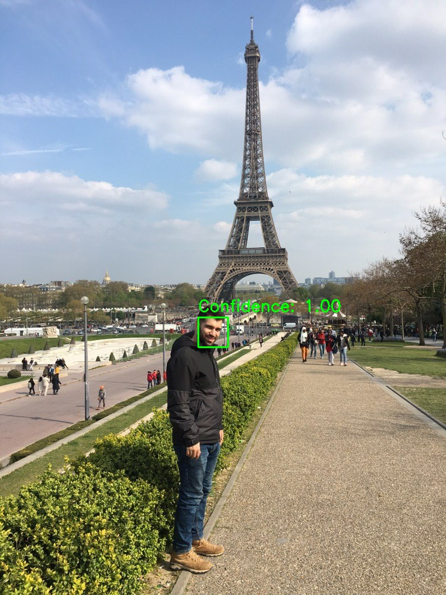

[](https://jupyter.org/try)
[](https://pypi.python.org/pypi/ansicolortags/)

This is a simple Python code for face detection in the image. We can see how computer vision is able to detect my face in the image as follows:


```python
import cv2
import matplotlib.pyplot as plt

# Load the pre-trained face detection cascade
face_cascade = cv2.CascadeClassifier(cv2.data.haarcascades + 'haarcascade_frontalface_default.xml')

# Load the image
image = cv2.imread('eifel.jpg')

# we see if the image was loaded 
if image is None:
    print("Unable to load the image")
    exit()

# we Convert the image to grayscale
gray = cv2.cvtColor(image, cv2.COLOR_BGR2GRAY)

# we perform face detection
faces = face_cascade.detectMultiScale(gray, scaleFactor=1.1, minNeighbors=7, minSize=(30, 30))

# boxes around the detected faces with confidence scores
for (x, y, width, height) in faces:
    roi_gray = gray[y:y+height, x:x+width]
    roi_color = image[y:y+height, x:x+width]
    confidence_score = 1.0  
    cv2.rectangle(image, (x, y), (x+width, y+height), (0, 255, 0), 2)
    cv2.putText(image, f"Confidence: {confidence_score:.2f}", (x, y-10), cv2.FONT_HERSHEY_SIMPLEX, 0.9, (0, 255, 0), 2)

# we convert BGR image to RGB for displaying in matplotlib
image_rgb = cv2.cvtColor(image, cv2.COLOR_BGR2RGB)

# Display the image 
plt.figure(figsize=(22, 18))
plt.imshow(image_rgb)
plt.axis('off')
plt.show()
# save
output_path = 'detected.jpg'
cv2.imwrite(output_path, image)
print(f"Output image saved as {output_path}")
```
Output image saved as detected.jpg





    


```python

```
